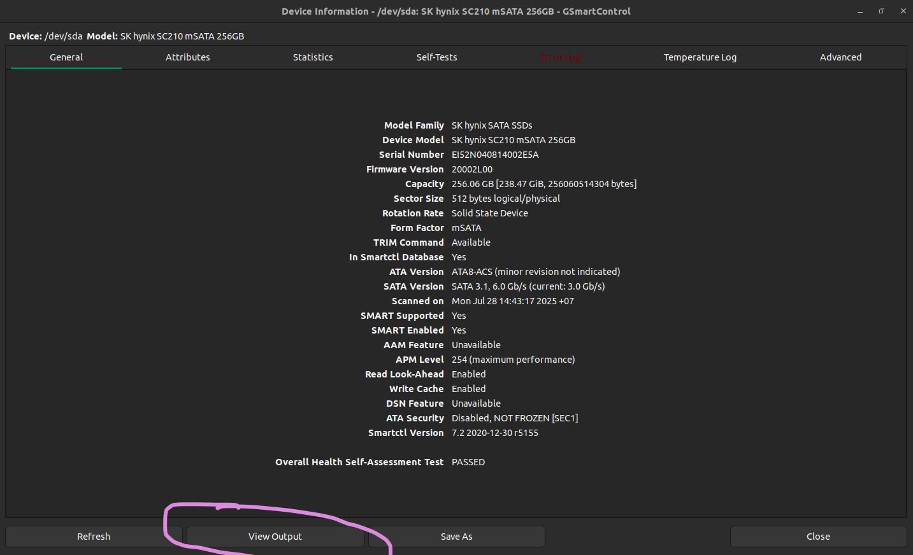
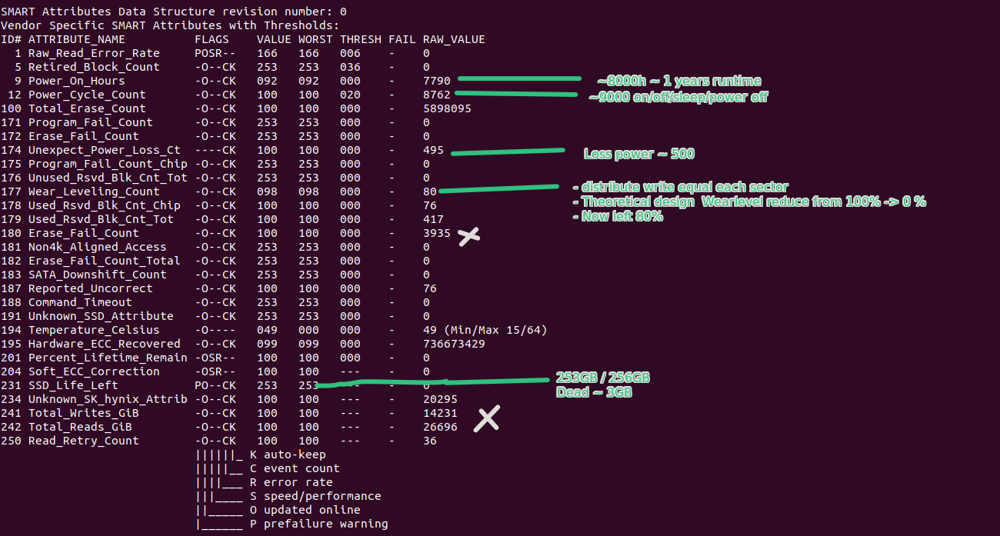

# Tools setup
- Package CLI: `smartctl` in `smartmontools` package
    - (Recommend) Or another solution is GUI: `GSmartControl`
    - All support install by `sudo apt install ...`

## Check info
- Run `GSmartControl`:

- `View output` -> Save as `File name.txt`
- After get file output, using `less` and fine these fields:
    - `less` is convenient than `cat` because can read from `top`

