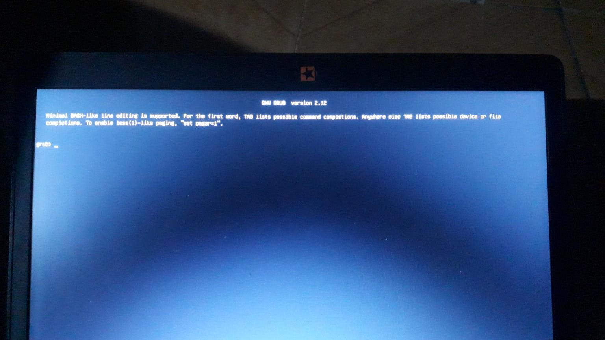

# Troubleshoot LUbuntu after installed
- Booting / Disk partitions
    - OS reboot display white black terminal
        - Retry link `Boot ESP/EFI partition` and retry `update-grub`, setup bind automatic with `Boot ESP/EFI partion` everytime reboot
    - Update partition designed if OS not accept it
        - Link `Swap partition` designed with OS everytime reboot
    
- Missing driver
    - [Auto find missing driver](#2-using-default-check-driver-software-additionnal-drivers)
- Internet
    - [Wifi connect faied](#wifi-connect-faied)
    - [Internet connected but can't browse DNS](#internet-connected-but-cant-browse-some-webpage)
- Keyboard, touchpad
    - [Missing Vietnamese keyboard]()
    - [Touchpad tap-to-click fail](#1-touchpad-tap-to-click-fail)
- dpkg install, AppImage missing dependencies
    - [Fix by apt](#app-fix-missing-dependencies)
    - [AppImage: require FUSE](#2-appimage-require-fuse)
    - [AppImage: chrome-sandbox is owned by root and has mode 4755](#3-appimage-chrome-sandbox-is-owned-by-root-and-has-mode-4755)

## Booting 
### Operating system
Result of boot problem below after install new `Lubuntu` from `USB boot` is before `chroot` to  
config `root` partition hasn't bind, mount enough requirements.
- Result is `grub-install` success but `update-grub` make config files were broken or wrong way.


- Solution:
    ```bash
    grub> ls
    # Now we have list of partitions have create by USB live

    (hd0) (hd0,gpt1) (hd0,gpt2) ...

    # try `ls` each partitons until find partions like `root`
    ls (hd0,gpt1)/

    # try find to `/boot/grub`
    # if found then try
    set root=(hd0,gpt1)
    set prefix=(hd0,gpt2)/boot/grub
    insmod normal
    normal

    ```
    - If lucky then success boot into LUbuntu GUI
        - Now when in real environment try:
        ```bash
        lsblk -f
        lsblk
        # try find the partition `root`
        
        # mount root partition line sdXi, note that sdXi do not choose sdX
        sudo mount /dev/sdXi # `/` ~ very large GB

        # mount EFI partition
        sudo mount /dev/sdXj # EFI ~ 100MB - 500 MB

        # try re grub-install
        sudo grub-install --target=x86_64-efi --efi-directory=/boot/efi --bootloader-id=lubun_1

        # try reupdate grub
        sudo update-grub
        ```
    - Last one, update auto bind with `EFI partition`, very useful if next time update-grub
    ```bash
    # check EFI partitions
    lsblk -f
    lsblf

    # check partition type
    sudo file -s /dev/nvme0n1p4 # suppose this is EFI partition
    # get UUID
    sudo blkid /dev/nvme0n1p4 # example UUID="89A5-6646", note not be PARTUUID

    # Last, add this partition to `/etc/ftab` - file system table:
    UUID=XXXX-XXXX /boot/efi vfat umask=0077 0 1
    # change XXXX-XXXX == PARTUUID
    # then add by `vi`
    sudo vi /etc/fstab

    UUID=89A5-6646 /boot/efi vfat umask=0077 0 1

    # try mount all exist in ftab 
    sudo mount -a

    # check
    lsblk
    lsblk -f

    # after that should reboot
    reboot
    ```

## Link `Swap partition` designed with OS everytime reboot
- `Check`:
    - Open Lubuntu, try run `htop` here can see `SWAP` is something wrong, it quite small (only default swap file create by linux)
    - Or type `lsblk` see partion not have `mount point` is `[SWAP]`, it only empty
- `Reason` of problem swap partion not using by OS is it was formated wrong `file system`.
    - Ubuntu require a swap partitions is `linuxswap` format, but it can format to another type like `ext4` or any option supply by `USB live` or other `Disk partition manager`
- `Solution` is boot in LUbuntu OS, using `KDE Partition manager`, choose right partitions `Swap` then format it to `linuxswap filesystem`
    - Now run `file`, it will check type of `SWAP` partition:
    ```bash
    # my partition for swap is nvme0n1p1 when check by `lsblk` or `KDE pm`

    sudo file -s /dev/nvme0n1p1
    /dev/nvme0n1p1: Linux swap file, 4k page size, little endian, version 1, size 524287 pages, 0 bad pages, LABEL=SWAP_MEM, UUID=e5ab7962-ce8e-4962-b685-3a0bd777ed3d
    # this inform point that this partition success format to Linux swap file
    # remember UUID=e5...
    sudo blkid /dev/nvme0n1p1 #if UUID not exist try run this command
                                # note that `file` is point exactly type of partition
                                # `blkid` only point `TAG TYPE` not deep check partition
                                # sometime user config `USB live` is wrong tag with type
                                # it is result we are here to fix missing `swap`

    ```
    - Last one, register this partitions with OS by run:
    ```bash
    sudo vi /etc/fstab # file system table
    # (this optional), we can find a `/swapfile` by OS auto gen when it run at origin here
    # try note it by \#/swapfile  swap    swap    defaults   0 0
    # then add Swap partition
    UUID=e5ab7962-ce8e-4962-b685-3a0bd777ed3d none swap sw 0 0

    # last one 
    sudo swapoff -a
    sudo swapon -a
    ```
    - Run `htop` now will update size == size of swap partition

## Internet connect faied

### 1. Missing Broadcom wireless driver
- Firt try `lspci | grep -i network` to check exist a Network module
    ```bash
    lspci | grep -i network
    
    -> Network controller: Broadcom Inc. and subsidiaries BCM43142 802.11bgn (rev 01)
    ```
- If network card interface exist like above try connect: Ethernet cable or a USB wifi 
- Now in `terminal` download:
    ```bash
    sudo apt update # fetch newest app list
    
    sudo apt install bcmwl-kernel-source
    ```
- After that, remove cable, usb then `reboot`

### 2. Using default check driver software `Additionnal Drivers`
- It can find on `Search bar` but if not exist:
    ``` bash
    sudo apt update
    sudo apt install software-properties-gtk
    ```
- Then check by tab `Additional Drivers`, install driver by list suggested

## Internet connected but can't browse some webpage
### 1. Missing register a DNS server
- Right click on `wifi` on the right down, `Edit connection`
- In `Connection interface` of current Wifi connected the setup IPv4 settings:
    - Field `Additional DNS server` input:
    ```txt
    8.8.8.8, 1.1.1.1
    ```
- After update ip of Google, Cloudflare then Save
- Try connect to webpage


## Keyboard troubleshoot

### 1. Missing Vietnamese typing
```bash
sudo apt update
sudo apt install ibus-unikey

ibus-setup # set up unikey typing in IBUS GUI
            # set up key combine `Shift+space`. Window + space not working

ibus restart
```


### 2. Touchpad tap-to-click fail

## App fix missing dependencies
### 1. Fix by app
```bash
sudo apt --fix-broken install
```
- Then try reinstall package was failed

### 2. AppImage require FUSE
```bash
dlopen(): error loading libfuse.so.2

AppImages require FUSE to run. 
You might still be able to extract the contents of this AppImage 
if you run it with the --appimage-extract option. 
See https://github.com/AppImage/AppImageKit/wiki/FUSE 
for more information
```

- Fix by install package:
```bash
sudo apt update
sudo apt install libfuse2
```

## 3. AppImage chrome-sandbox is owned by root and has mode 4755.
- Solution is add `--no-sandbox`
```bash
./arduino-ide_nightly-20250730_Linux_64bit.AppImage --no-sandbox
```