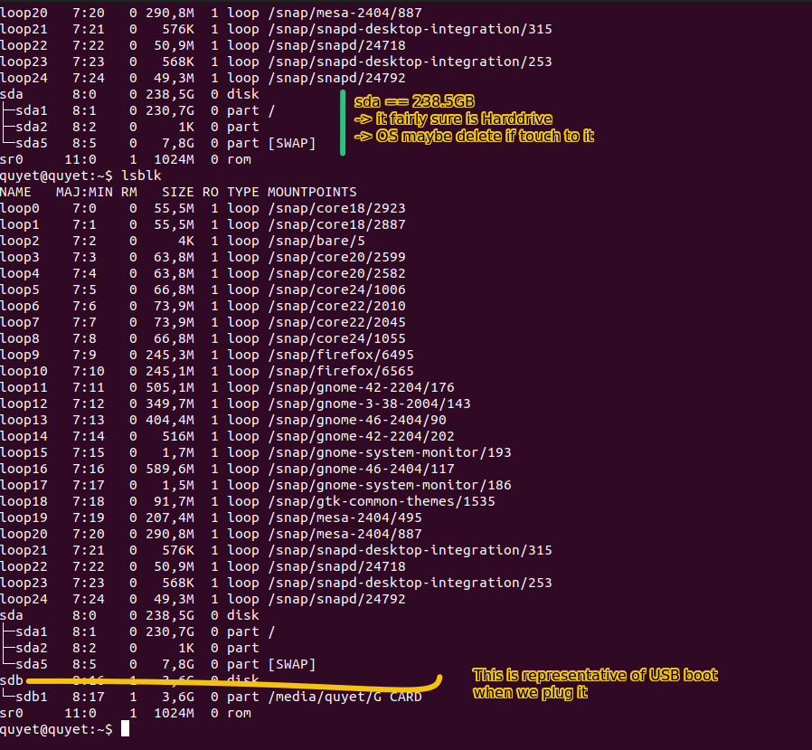
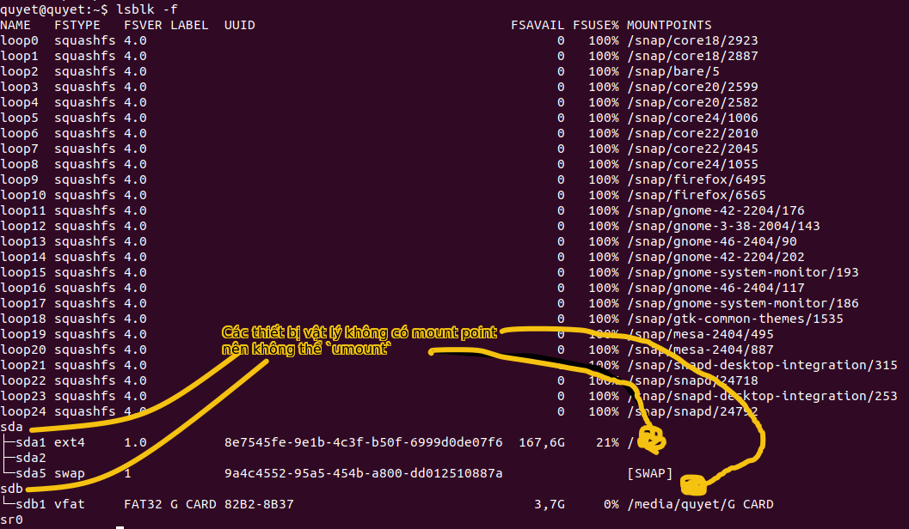

# Refer
- [Ubuntu variants](https://ubuntu.com/desktop/flavors)
- [Install Lubuntu](https://manual.lubuntu.me/stable/1/1.3/installation.html)
- [Master boot record](https://en.wikipedia.org/wiki/Master_boot_record)
- Nội dung
    - [so sánh bản phân phối Flavors](#so-sánh-các-bản-phân-phối-ubuntu-ubuntu-flavors)
    - [Tạo usb boot Lubuntu trên Ubuntu](#tạo-usb-boot-lubuntu)
    - [Lưu ý quan trọng khi đổi giao diện Flavors](#lưu-ý-quan-trong-khi-chuyển-đổi-giữa-các-giao-diện-ubuntu-flavors)

- Gợi ý:
  - Nên dùng chuẩn UEFI vì nó chương trình cập nhật tương thích với các ổ cứng HDD, sata , nvme
    - Cấu trúc bảng `GPT` kết hợp với bootloader `GRUB` cho phép tương thích ngược với `Legacy`
    - Ưu điểm UEFI cho phép quản lý nhiều phân vùng hơn khi nó yêu cầu 1 partition riêng cho hệ thống quản lý phân vùng EFI System Partition thay vì chỉ 4 phân vùng nhưu `Legacy`
  - Một số usb boot chỉ có `MBR` trong `iso` nên yêu cầu Legacy thì cần chuyển về `Legacy`

# So sánh các bản phân phối Ubuntu (Ubuntu Flavors)

| Phân phối (Flavor) | Desktop Environment (DE)  | Ưu điểm chính                               | Dung lượng RAM (idle) | Đối tượng phù hợp        |
|--------------------|---------------------------|---------------------------------------------|------------------------|--------------------------|
| **Ubuntu**         | GNOME                     | Đẹp, hiện đại, dễ dùng, tích hợp tốt        | ~900–1.2 GB            | Người mới, máy mạnh     |
| **Kubuntu**        | KDE Plasma                | Cực kỳ đẹp, nhiều tùy chỉnh, nhẹ hơn GNOME  | ~700–1 GB              | Người thích đồ họa đẹp, tùy biến |
| **Xubuntu**        | XFCE                      | Rất nhẹ, ổn định, tối giản                   | ~400–500 MB            | Máy cũ, cấu hình yếu    |
| **Lubuntu**        | LXQt                      | Nhẹ nhất, đơn giản, rất nhanh               | ~300–400 MB            | Máy rất cũ, netbook     |
| **Ubuntu MATE**    | MATE                      | Giao diện giống GNOME 2, thân thiện         | ~500–600 MB            | Người thích truyền thống|
| **Ubuntu Budgie**  | Budgie                    | Đẹp, hiện đại, đơn giản, thanh lịch         | ~700–800 MB            | Người dùng bình thường  |
| **Ubuntu Studio**  | KDE Plasma (tùy biến)     | Hỗ trợ đồ họa, audio/video, nghệ thuật số   | ~800–1 GB+             | Nhà sáng tạo nội dung   |
| **Edubuntu**       | GNOME (hướng giáo dục)    | Cho giáo viên, trường học, trẻ em           | ~900 MB                | Trường học, lớp học     |
| **Ubuntu Unity**   | Unity                     | Giao diện cũ của Ubuntu (2010–2017), đơn giản| ~700–800 MB           | Fan Unity cũ            |
| **Ubuntu Kylin**   | UKUI (LXQt-based)         | Bản dành cho Trung Quốc (tiếng Trung, app riêng)| ~700–800 MB        | Người dùng Trung Quốc   |

---

## ✅ Ghi nhớ:

- **Kernel** (hạt nhân) và **package base** là như nhau (Ubuntu base).
- Chỉ khác nhau **DE (desktop environment)** và **app cài sẵn ban đầu**.
- Tất cả đều:
  - Được **Canonical bảo trì hoặc cộng đồng hợp tác chính thức**.
  - Có thể cập nhật, nâng cấp như nhau (ví dụ từ 22.04 lên 24.04).
  - Có thể cài DE khác nếu bạn thích mix (nhưng nên biết cách quản lý).

---

## 🔍 Gợi ý chọn bản:

| Mục đích dùng             | Gợi ý bản phân phối           |
|---------------------------|-------------------------------|
| Máy cũ, RAM < 2GB         | Lubuntu, Xubuntu              |
| Muốn hệ điều hành nhẹ     | Xubuntu, Ubuntu MATE          |
| Ưu tiên giao diện đẹp     | Kubuntu, Ubuntu Budgie        |
| Dùng cho sáng tạo (DAW)   | Ubuntu Studio                 |
| Chạy thử, cài nhanh       | Lubuntu (ISO nhẹ, cài nhanh)  |
| Trường học, giáo dục      | Edubuntu                      |
| Máy mạnh, dễ dùng         | Ubuntu (GNOME), Kubuntu       |


# Tạo usb boot Lubuntu
- Sở dĩ chọn Lubuntu vì 3 lý do:
  - Usb chỉ có 3.5GB
  - Lubuntu rất nhẹ và có giao diện hướng tới người dùng Window
  - Lubuntu hướng tới phân khúc lập trình app từ Qt
## 1. Tải Lubuntu 24.04.2
- [Download 24.04 LTS](https://lubuntu.me/downloads/)
  - Chỉ tải file .iso cho usb boot. `iso` hay disk image là 1 bản chụp chuẩn xác của phần mềm hệ thống (hệ điều hành hoặc đĩa DVD/CD cũ) đang chạy ổn định nhưng yêu cầu là khi chạy nó phải được mount như 1 ổ độc lập hoặc tải tòan bộ vào RAM để chạy an toàn. (Bao gồm các gói phụ trợ để nó chạy tốt ). 
  - Lubuntu chỉ còn hỗ trợ 64 bit
  - Dung lượng 3.1GB cho bản 24.04LTS

## 2. Chuẩn bị trước khi tạo USB boot
- Đầu tiên cần sử dụng công cụ `lsblk` (list block device) để duyệt hệ thống thiết bị dạng block gồm:
ổ cứng, thẻ nhớ, ... miễn là chúng lưu dữ liêụ dạng block.
  ```bash
  lsblk
  ```
- Đảm bảo `usb` dùng để boot phải được tìm thấy dưới dạng `sdX` và các phân vùng con của nó là `sdXi`
  - Ví dụ:  
  
  - Thêm option `-f` để thêm thông tin
  
- Sau đó thực hiện lệnh `unmount` để unmount các phân vùng ảo `sdXi` được tạo ra từ `sdX`
  - Lưu ý rằng device `sdX` là không thể unmount vì nó đại diện phần cứng usb đang cắm vào máy, nhìn ảnh trên nó không hề có mount point như `sdXi`
  ``` bash
  ~$ sudo umount /dev/sdb
  umount: /dev/sdb: not mounted.
  ```
  - Ví dụ trên cần gỡ `sdb1` để hệ thống không block nó khi nạp `iso`:
  ```bash
  sudo umount /dev/sdb1
  
  # hoặc đơn giản hơn là 
  sudo umount /dev/sdb* # không dùng "" vì nó ngăn mở rộng *

  ```
- OK giờ kiểm tra lại `lsblk -f` xem sdXi còn `mountpoint` không nếu nó mất như sdX là ok rồi.

## 3. Tải iso vào usb boot
- Công cụ sử dụng giờ là `dd` - data duplicator.
- Gọi lệnh chép file vào usb:  
  - `sudo dd if=/path/to/your.iso of=/dev/sdX bs=4M status=progress oflag=sync`
  - if là input file, of là output file, bs là block size read từ input -> output 
- Cuối dùng là dùng công cụ `sync`
  - ```bash
    sync # fflush toàn bộ tiến trình trnog hệ thống trong đó có dd để đảm bảo mọi file đã được ghi xuống.
          # nó sẽ blocking cho đến khi fflush hết
          # đôi khi dd không chờ fflush mà nó tắt luôn thì gây thiếu dữ liệu khi rút usb đột ngột hoặc reject sớm
    ```
## 4. cài hệ điều hành
### Cấu hình quản lý ổ cứng (Disable/AHCI/RAID)
- Linux yêu cầu cấu hình BIOS nhận dạng ổ cứng là `AHCI` thay vì `RAID`, các chế độ BIOS hỗ trợ Harddrive:
  - `Disable` dùng cho đời cũ như HDD
  - `AHCI` hỗ trợ cấu hình HDD, SSD chạy độc lập, chỉ dùng được 1 ổ ở 1 thời điểm
  - `RAID` hỗ trợ chạy song song nhiều ổ SSD, HDD.
    - RAID mode 0 cần ổ >= 2, tổng dung lượng các ổ gộp thành 1 ổ
      - hỏng 1 ổ là hỏng hết dữ liệu
    - RAID mode >=1 thì ưu tiên chạy song song các ổ và mỗi ổ lưu back up của ổ chính
      - An toàn dữ liệu vì có back up
- Linux `không có firmware nhân diện RAID` nên khi cài USBboot mà dùng mode `RAID` sẽ không thấy được ổ cứng
  - `Phải set sang AHCI`

### Cấu hình quản lý bootmode (Legacy)
- Tiếp theo, mặc định khi cài theo kiểu `Erase disk` thì sẽ tạo lại bảng `MBR`
  - `MBR` thì chỉ hỗ trợ tạo 4 partitions và quản lý đến 2TB
  - `GPT` có thể  tạo lớn hơn và nhiều phân vùng hơn nhưng không hỗ trợ boot Legacy (chọn ổ cứng tuần tự) cho máy cũ
- Vì vậy chỉ có thể dùng Legacy boot mode để duyệt tuần tự ổ qua `MBR`
- Sau khi cài LUbuntu bằng `Erase disk` hệ thống `MBR` được setup nhưng nó có thể không biết cách khởi động `Lubuntu` vì vậy khi restart máy báo `No boot device found`   
  Phải làm sao? khi này cần cài thêm cho nó bootloaer tên là `GRUB`
  - Lưu ý cái này là cài `Linux`, còn `Window` không dùng `GRUB` mà dùng phần mềm riêng và tự động của nó.
  - Nếu cài `Window` sau linux thì phải cấu hình lại `GRUB` là `bootloader` nếu không không thể tìm ra Linux do đang dùng `window bootloader`
    - Như vậy `GRUB` có thể tìm ra Window nhưng ngược lại thì không 
- Sự khác nhau giữa Legacy/UEFI:
  - Legacy là chuẩn boot kiểu cũ, hỗ trợ tìm boot `MBR` nằm tại địa chỉ 0x0000, tại sector 0
  - UEFI là chuẩn boot kiểu mới, hỗ tợ tìm file cấu hình trong `GPT` tại sector 1  
    bên cạnh đó sector 0 sẽ được nạp 1 `MBR` giả để tương thích ngược với legacy.
      - Nếu cần `Legacy`, khi cấu hình phân vùng ta phải để chừa ra 1 đến 2MB để GRUB tìm đến nó.


### Cấu hình hệ thống file
- `ntfs` cho Window
- `ext4` cho linux

### Cấu hình lại GRUB cho hệ thống Legacy (HDD, SATA, maybe support NVME (notrecommend))
1. Với `MBR` được giới thiệu trong wiki, nó nằm ở đầu ổ đĩa nơi mà BIOS tìm đến để nạp Bootloader tại đây ra RAM:
  - MBR có cấu trúc classic bao gồm:
    - Bootstrap code area ở địa chỉ  `0x0000`, tổng size `446 bytes`
      - Dùng để chứa chương trình `bootloader`
    - `0x01BE` , `0x01CE` , `0x01DE`, `0x01EE` mỗi phần này rộng 16byte để lưu mô tả các `partitions` từ 1 - 4 như đã nói trên thì MBR chỉ hỗ trợ 4 partions (thiết kế cứng luôn)
      - Mỗi partition có thể là 1 hệ điều hành hoặc ổ của hệ điều hành
      - Mặc định bootloader cơ bản nhất chỉ nhì partion đầu tiên và nhảy luôn vào hệ điều hành
        - Các partion còn lại làm ổ con cho nó
    - tại `0x01FE` sau đó là 2 byte `Boot signature`
  - => tổng MBR là 512 byte (== 1 sector cho ổ cứng)
  - ngoài ra trong Wiki đề cập 1 số cấu trúc khác nhưng không đi sâu hơn nữa.
2. Tiếp theo là bootloader `GRUB`, đây là bootloader sau đời sau, có hỗ trợ quản lý vấn đề chạy được nhiều
hệ điều hành trên 1 máy.
  - Như logic trên thì có thể có đến 4 hệ điều hành chạy song song và không có ổ con cho chúng
    - Ngoài ra GRUB có thể cấu hình phức tạp để tạo ra nhiều ổ hơn  
      thông qua việc modify parition cuối cùng thành 1 bảng logic để tự quản lý vùng này.
  - `GRUB` (Grand Unified Bootloader) cung cấp giao diện lựa chọn trực quan thay vì chỉ boot luôn vào phân
  vùng đầu tiên.
    - Bootloader GRUB nằm tại `Bootloader` của `MBR`
    - Phần thứ 2 của chương trình nằm strong vùng `gap` được thiết kế ở giữa `MBR` và `partition 1`
      - Các chương trình chia ổ cứng, quản lý ổ yêu cầu `partition 1` luôn phải bắt đầu ở vị trí 
      bắt đầu từ sector 2048. như vậy Theo lý thuyết phần MBR có thể mở rộng ra 2048 lần ban đầu.
        - Vùng gap tương đương 2047 sector khoảng (gần 1MB)
        - Vì vậy chương trình này cho khả năng quản lý vượt trội hơn.
  - `GPT` sẽ không nói ở đây dù nó khá vượt trội

3. Nạp `GRUB` cho `MBR`:
  - `GRUB` chỉ support `Linux` hoặc OS like Unix
    - Nếu 1 window được cài vào hệ thống, bootloader riêng của nó sẽ ghi đè MBR để xóa GRUB
  - Trong `USB Boot` mở terminal:
    - OK giờ thực hiện cẩn thận `grub-install` và `update-grub`
    - Trong `USB boot terminal` nhảy đến mục `/mnt` để `mount` với LUbuntu vừa cài.
      - Gõ `lsblk` để tìm tên của ổ cứng, ở đây có thể là:
        - `sdX` cho SSD `sata` hoặc `nvme0n1` hoặc tương tự cho SSD `nvme`
      - Gõ `lsblk -f` để xem tên của ổ là gì, ở dây bên trong `nvme0n1` có 1 phân vùng con là `nvme0n1p1` là vùng nhớ cho OS Lubuntu đã cài.
      - Giờ trong `/mnt` tạo thư mục tên là `local_lubun_root` hoặc gì đó tùy
  - Giờ cấu hình liên kết với hệ điều hành Lubuntu để cài hệ thống `GRUB`:
    - chạy tập lệnh:
    ```bash
    sudo mount /dev/nvme0n1p1 local_lubun_root # bind với hệ thống file thật

    sudo mount --bind /dev  local_lubun_root/dev # file ảo phải bind thì không có hệ thông file để link
    sudo mount --bind /proc local_lubun_root/proc
    sudo mount --bind /sys  local_lubun_root/sys

    sudo chroot local_lubun_root

    ```

    - Giờ ta đang trong hệ thông file của Lubuntu rồi, thực hiện các bước sau để cài đặt `GRUB` và đăng ký
    cho Lubuntu 1 file config, sau này `GRUB` tìm đến nó
      - Tìm đến ổ cứng để cài `GRUB`
      ```bash
      lsblk -f # duyệt ổ cứng, tìm tên đại diện cho ổ cứng ,  
      ```
        - Lưu ý ổ cứng chứ không phải các partion hay ổ con
          - Ví dụ:
            - `nvme0n1` chứ không phải `nvme0n1p1`
            - `sdX` chứ không phải `sdXi`

      - Cài `GRUB` theo chế độ `legacy mode` hỗ trợ ssd sata, hdd nhưng nvme hầu như không hỗ trợ nếu bios Legacy đời cũ không hiểu giao tiếp nvme và thường bị bỏ qua khi duyệt:
        ```bash
        grub-install /dev/[harddrive] # ổ tùy máy nhưng không bên dùng Legacy cho nvme, chỉ nên HDD hoặc sata

        update-grub # cập nhật file GRUB config cho hệ điều hành
        ```
      - Cài `GRUB` theo chế độ `UEFI` hỗ trợ tốt cho sata và nvme

### Cấu hệ thống UEFI (HDD, SATA, NVME) 
- [Setup GPT partion](https://askubuntu.com/questions/1253586/how-can-lubuntu-20-04-lts-be-installed-in-a-usb-which-can-boot-into-both-uefi)
- Bên trong USB boot có thể chọn chế độ `Manual partition` và làm theo cấu hình link trên


# Lưu ý quan trong khi chuyển đổi giữa các giao diện Ubuntu (Flavors)
- Tốt nhất là cứ tải các bản DE về nhưng đừng gỡ bản cũ vì nó gây lỗi giao diện nếu khoogn biết thao tác.
- Giữ lại bản cũ đôi khi dễ hơn khi chuyển qua lại các giao diện qua đăng nhập