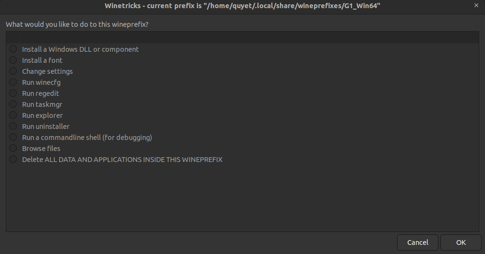

# reference
- [Wine user guide](https://gitlab.winehq.org/wine/wine/-/wikis/Wine-User%27s-Guide#introduction)

# topic
- [About](#about-wine)
- [instalation window architechture](#install-on-ubuntu)
    - [install wine64 and 32](#1-install-2-wine-window-type-architechture)
    - [install winetricks for manage wine machines](#2-install-winetricks)
    - [install a new window wine machine](#3-create-new-wine-machine)
- [Download necesary packet]()
- [Install new window app by WINEPREFIX]()

## About wine
- Window programs won't run in Linux because of them instructions.
    - Linux can't understand until they are translated by the Windows environment.
    - First solution to run both Window and Linux app is install both OS
        that mean "dual booting"
        - It diffcult for user when reboot OS to use another applications
    - Another solution is install an virtual OS on main OS
        - This mean Window can run along side with Linux, and it make waste a lot of CPU, RAM
    - The last solution is using a `interpeter` line `Wine` for linux or `WSL` for window
        - Any Window programs install and manage by `Wine` and send command to `Wine`
            then `Wine` translate to linux command
        - That similar with `Wsl` when translate Linux command -> window command

## Install on Ubuntu
### 1. Install 2 `wine` window type architechture:
```bash
sudo apt update
sudo apt install wine64 wine32
```

### 2. Install winetricks
- install winetricks manager wines
```bash
sudo apt install winetricks
```


### 3. Create new wine machine
1. Run winetricks
```bash
winetricks
```
2. Choose `Create new wineprefix`
    - Choose `Architecture`: 32 for 32bit applications or 64 for both 32 and 64 bit apps
    - Input a name for machine
    - `OK` and now when anytime run `winetricks` machine name will exist for choosing

## Download necessary packet
- in `winetricks` -> chose `your machine name` -> download `dll, library` from menu

## Install an application for wine machine
### Basic method
- After install wine machine, we can go to winetrick to see wineprefix like this:
    - 
- Remember this `prefix` link, then type in new `bash`:
    ```bash
    export WINEPREFIX="prefix link"
    wine [file.exe] # <- exe file
    wine msiexec /i [something.msi]  # <- wine call program `msiexec` then send flag install /i and file .msi
    ```
### Install by winetricks
- In winetricks, find your machine want install application
- Choosing open `Run explorer`
- Here we can find where the file `exe` `msi` ... exist
- Choose it and install in expect folder of this wine machine
