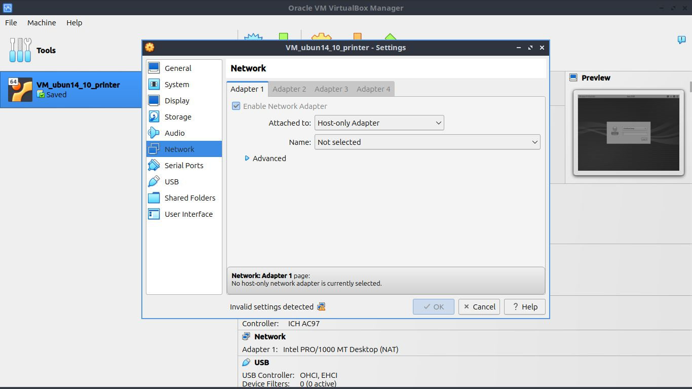

# Using ` cups - Common Unix Printing System `- manage printer:
- `http://localhost:631`
- If missing driver for printer like Canon LPB2900, see how to fix below
    - [missing driver](#error-package-libglade2-0-is-not-installed)
    - [missing cups](#install-cups-when-not-install)
    - [create new printer](#create-new-printer-after-connect-usb-cable)
    - [apparmor DENIED](#error-dmesg-say-apparmordenied)
    - [Nothing print but cups say printed](#error-ps-say-100-and-print-success-but-nothing-printed)
    - [captstatusui say Check the DevicePath of /etc/ccpd.conf](#captstatusui-say-check-the-devicepath-of-etcccpdconf)
    - [Driver solution](#driver-solution---missing-driver)
        - [1. Try install necessary drivers](#driver-solution-1---missing-necessary-drivers)
        - [2. Try install another suggest drivers](#driver-solution-2---try-install-other-libaries-if-missing)
        - [3. Try reinstall cndrvcups](#driver-solution-3---remove-cndrvcups-capt-amd64-and-install-version-i386) 
    - [Wine, Docker, Virtual Machine, parallel OS ... to an lower OS like 14.04 or window](#wine-docker-virtual-machine-parallel-os--to-an-lower-os-like-1404-or-window)
        - [Clean current OS, delete old config did above]()

# Download canon printer driver from cannon:
## Error: `Package libglade2-0 is not installed`
- download driver pakage: https://vn.canon/vi/support/0100459601?model=0017B011
- When try install Debian pakage `cndrvcups-capt_2.71-1_amd64.deb`, `cndrvcups-common_3.21-1_amd64.deb`
    - Error occur missing `libglade2-0` library:
        ```bash
        dpkg: dependency problems prevent configuration of cndrvcups-capt:
        cndrvcups-capt depends on libglade2-0 (>= 1:2.5.1); however:
        Package libglade2-0 is not installed.
        cndrvcups-capt depends on cndrvcups-common (>= 3.21); however:
        Package cndrvcups-common is not installed.

        dpkg: error processing package cndrvcups-capt (--install):
        dependency problems - leaving unconfigured
        Errors were encountered while processing:
        cndrvcups-capt
        ```
- Solution: 
    - [Get package deb for x86 or x64](https://www.ubuntuupdates.org/package/core/plucky/universe/base/libglade2-0)
    - `sudo dpkg -i [deb file]`
    - After that reinstall `cndrvcups-common_3.21-1_amd64.deb` then `cndrvcups-capt_2.71-1_amd64.deb`
    - Done
    ```bash
    giangtrinh@giangtrinhLU:/dev$ dpkg -l | grep "cndrvcups"
    ii  cndrvcups-capt                                2.71-1                                   amd64        Canon CAPT Printer Driver for Linux
    ii  cndrvcups-common                              3.21-1                                   amd64        Canon Printer Driver Common Modules Ver.3.21
    ```

## Install `cups` when not install
```bash
sudo apt update
sudo apt install cups

# start system service for cups
sudo systemctl start cups
sudo systemctl enable cups # enable cups automatic when reboot
```

## Create new printer after connect USB cable
- go to `http://localhost:631`
- create new `LPB2900` printer with driver downloaded

## Error `dmesg` say `apparmor="DENIED"`
```bash
sudo dmesg | tail -10  #or using ` sudo journalctl -f ` to see at runtime

`[ 3353.232651] audit: type=1400 audit(1754013261.900:163): apparmor="DENIED" operation="capable" class="cap" profile="/usr/sbin/cupsd" pid=13748 comm="usb" capability=12  capname="net_admin"
[ 3353.241739] usblp0: removed # lp is line printer
```

- When `success` setup driver for Cannon2900 and using `cups` to print test page or print a page
it say `Print done` bit printer do nothing, then check `dmesg` as above.

- Solution:
    - Temporarily change `apparmor` block/enforce to warning/complain with `cups`
        - Must download `apparmor-utils`
        ```bash
        sudo apt install apparmor-utils
        ```

        - First check `apparmor` properties 
        ```bash
        sudo aa-status | nl  | less > log.txt # nl-numberline
        ```
        - Here can see `"/usr/sbin/cupsd"` ar in `enforce` by `apparmor` like above
        - Now change temporary to `complain` mode:
        ```bash
        sudo aa-complain /usr/sbin/cupsd # only warn but not block when interract with usb connect
        ```
        - Check `sudo aa-status | nl  | less` now `/usr/sbin/cupsd` is complain mode
    - Try re print a new page
    - Print still failed but `apparmor` ALLOW `usr/sbin/cupsd` connect to usblp0
    ```bash
    sudo dmesg | tail -10 

    [ 5790.329116] usblp 1-3:1.0: usblp0: USB Bidirectional printer dev 8 if 0 alt 0 proto 2 vid 0x04A9 pid 0x2676
    [ 6060.086292] audit: type=1400 audit(1754016530.868:194): apparmor="ALLOWED" operation="capable" class="cap" profile="/usr/sbin/cupsd" pid=1075 comm="cupsd" capability=24  capname="sys_resource"
    [ 6065.022865] audit: type=1400 audit(1754016535.806:195): apparmor="ALLOWED" operation="capable" class="cap" profile="/usr/sbin/cupsd" pid=1075 comm="cupsd" capability=24  capname="sys_resource"
    [ 6065.040704] audit: type=1400 audit(1754016535.824:196): apparmor="ALLOWED" operation="capable" class="cap" profile="/usr/sbin/cupsd" pid=16255 comm="usb" capability=12  capname="net_admin"
    [ 6065.050722] usblp0: removed
    [ 6070.191756] audit: type=1400 audit(1754016540.975:197): apparmor="ALLOWED" operation="capable" class="cap" profile="/usr/sbin/cupsd" pid=1075 comm="cupsd" capability=24  capname="sys_resource"
    [ 6074.547245] usblp 1-3:1.0: usblp0: USB Bidirectional printer dev 8 if 0 alt 0 proto 2 vid 0x04A9 pid 0x2676
    [ 6088.381509] audit: type=1400 audit(1754016559.166:198): apparmor="ALLOWED" operation="capable" class="cap" profile="/usr/sbin/cupsd" pid=1075 comm="cupsd" capability=24  capname="sys_resource"
    [ 6089.835965] audit: type=1400 audit(1754016560.621:199): apparmor="ALLOWED" operation="capable" class="cap" profile="/usr/sbin/cupsd" pid=1075 comm="cupsd" capability=24  capname="sys_resource"
    [ 6093.186289] audit: type=1400 audit(1754016563.972:200): apparmor="ALLOWED" operation="capable" class="cap" profile="/usr/sbin/cupsd" pid=1075 comm="cupsd" capability=24  capname="sys_resource"
    ```
### Turn on `apparmor` it not using this method
```bash
sudo aa-enforce /usr/sbin/cupsd # only warn but not block when interract with usb connect
```

## Error `ps` say 100% and print success but nothing printed
- Refer: https://askubuntu.com/questions/1038603/printing-issue-canon-lbp2900
- Refet: https://forums.linuxmint.com/viewtopic.php?t=332788

- Because LBP2900 is CAPT (Canon Advanced Printing Technology) type printer
    - It need a `daemon` is called `ccpd` - Canon CAPT Daemon - handle and send to USB printer
    - First [read tutorial flow LBP2900 driver](./doc/README-capt-2.71UK.txt)
    - Try check `ccpd`:
    ```bash
    systemctl is-active ccpd 
    inactive #return

    systemctl status ccpd
    ○ ccpd.service # return
        Loaded: loaded (/etc/init.d/ccpd; generated)
        Active: inactive (dead)
        Docs: man:systemd-sysv-generator(8)
    ```
    - Here `ccpd` inative, try `sudo systemctl start ccpd` it will call daemon `sudo /etc/init.d/ccpd start` automatically
    ```bash
    systemctl is-active ccpd
    active
    ```

    - After this step, if printer still print nothing, check `ccpdadmin`:
        - Check `sudo /usr/sbin/ccpdadmin`
            - If printer created not exist here, try add by hand
                ```bash
                sudo /usr/sbin/ccpdadmin -p [printer name created by CUPS] -o /dev/usb/lp0
                # check line printer (lp0 or another): sudo dmesg | grep 'usblp'
                ```
            - If old printer not use exist here, try:
                ```bash
                sudo /usr/sbin/ccpdadmin -x [printer name created by CUPS]
                ```
        - Try restart ccpd:
            ```bash
            sudo systemctl stop ccpd # stop == sudo /etc/init.d/ccpd stop
            sudo systemctl status ccpd #check
            sudo systemctl start ccpd # start
            sudo systemctl status ccpd #check
            ```
            - **ERROR: when **`stop`**, CPU reach 100% and hanging laptop. Best solution is reboot computer or `sudo pkill -9 ccpd`**
        
    - Try print, if nothing print, do this step:
    ```bash
    # try stop ccpd, kill ccpd if it not stop like above

    echo Y | sudo tee /sys/module/usbcore/parameters/old_scheme_first
    # using old method identify usb type device
    
    # then start ccpd
    ```

## `captstatusui` say Check the DevicePath of /etc/ccpd.conf
- Command check capt printer status:
    ```bash
    captstatusui -P LBP2900 #LBP2900 or name of printer add by cups
    ```
- Reason when get error like topic follow there: https://askubuntu.com/questions/1035727/printer-error-check-the-devicepath-of-etc-ccpd-conf

## Driver solution 1 - missing necessary drivers
- Tutorial link refer: https://www.youtube.com/watch?v=FE_8jxyoOh0&t=74s
    - [libpango](https://askubuntu.com/questions/1522995/errors-installing-canon-printer-lbp2900-on-lubuntu-24-04)
- Require libs in LBP2900 [README](./doc/README-capt-2.71UK.txt)

- First sure turn on suport i386 structure
    ```bash
    giangtrinh@giangtrinhLU:~$ 
    sudo dpkg --add-architecture i386
    [sudo] password for giangtrinh: 
    giangtrinh@giangtrinhLU:~$ dpkg --print-foreign-architectures
    i386

    sudo apt update

    # Install require package as tutorial link above
    sudo apt-get install libatk1.0-0:i386 libcairo2:i386 libgtk2.0-0:i386 libpango1.0-0:i386 libstdc++6:i386 libxml2:i386 libpopt0:i386

    # error catch missing directories
    Reading package lists... Done
    Building dependency tree... Done
    Reading state information... Done
    Note, selecting 'libatk1.0-0t64:i386' instead of 'libatk1.0-0:i386' # 1
    Note, selecting 'libgtk2.0-0t64:i386' instead of 'libgtk2.0-0:i386' # 2
    E: Unable to locate package libpango1.0-0:i386 # 3
    E: Couldnt find any package by glob 'libpango1.0-0'
    E: Couldnt find any package by regex 'libpango1.0-0'

    # ibatk1.0-0t64:i386
    sudo apt install libgtk2.0-0t64:i386 # or ibatk1.0-0t64
    # ibatk2.0-0t64:i386
    sudo apt install libgtk2.0-0t64:i386

    # libpango-1.0-0:i386
    sudo apt install libpango-1.0-0:i386

    # Follow README LBP2900
    # <For Ubuntu 12.04(64-bit)>
    # apt-get install libglade2-0
    # apt-get install ia32-libs
    # apt-get install libpopt0:i386

    # <For Ubuntu 14.04/14.10(64-bit)>
    # apt-get install libglade2-0     # setup above
    # apt-get install libxml2:i386
    # apt-get install libstdc++6:i386
    # apt-get install libpopt0:i386

    sudo apt-get install libxml2:i386
    sudo apt-get install libstdc++6:i386
    sudo apt-get install libpopt0:i386

    ```
- Safe restart service:
    ```bash
    # Kill daemon ccpd
    sudo systemctl stop ccpd
    sudo pkill -9 ccpd

    # restart CUPS service
    sudo systemctl restart cups

    # restart ccpd
    sudo systemctl start ccpd
    ```

## Disable `usblp`, fix sometime `journalctl` report `usblp0 remove`
- `usblp` is conflict with usb `capt` type printer
- Solution using `modprobe` to disable `usblp`
```bash
echo "blacklist usblp" | sudo tee /etc/modprobe.d/blacklist-usblp.conf
reboot
```


### Turn on `usblp` if it not help need
- Delete file blacklist `/etc/modprobe.d/blacklist-usblp.conf` then reboot

## Driver solution 2 - Try install other libaries if missing
- [Retry Link Tutorial](https://www.youtube.com/watch?v=FE_8jxyoOh0&t=74s)

```bash
# Try install `sudo apt install libgladeui-2-13t64:i386` in apt list i386
sudo apt install libgladeui-2-13t64:i386 # new, but no effect


# youtube tutorial (all was installed before)
sudo apt install libavahi-client3:i386 # exist
sudo apt install libavahi-common-data:i386 # exist
sudo apt install libavahi-common3:i386 # exist
sudo apt install libblkid1:i386 # exist
sudo apt install libcom-err2:i386 # exist
sudo apt install libcups2:i386 # exist
sudo apt install libdatrie1:i386 # exist
sudo apt install libdbus-1-3:i386 # exist
sudo apt install libfontconfig1:i386 # exist
sudo apt install libfreetype6:i386 # exist
sudo apt install libgail-common:i386 # exist
sudo apt install libgail18t64:i386 # libgail18:i386  # exist
sudo apt install libgcrypt20:i386
sudo apt install libgdk-pixbuf-2.0-0 #ibgdk-pixbuf2.0-0:i386 
sudo apt install libglib2.0-0t64 #llibglib2.0-0:i386 
sudo apt install libgmp10:i386 
sudo apt install libgnutls30t64:i386 #libgnutls30:i386 
sudo apt install libgpg-error0:i386 libgraphite2-3:i386 libgssapi-krb5-2:i386 libharfbuzz0b:i386 
sudo apt install libhogweed6t64:i386 #libhogweed4:i386
sudo apt install libidn2-0:i386 libjbig0:i386 libjpeg-turbo8:i386 libjpeg8:i386 libk5crypto3:i386 
sudo apt install libicu74:i386 # libicu60:i386
sudo apt install libkeyutils1:i386 libkrb5-3:i386 libkrb5support0:i386 liblz4-1:i386 liblzma5:i386 
sudo apt install libnettle6:i386 # missing ***
sudo apt install libmount1:i386  libp11-kit0:i386 libpango-1.0-0:i386 libpangocairo-1.0-0:i386 
sudo apt install libpangoft2-1.0-0:i386 libpangox-1.0-0:i386 libpangoxft-1.0-0:i386 libpcre3:i386 libpixman-1-0:i386 libpng16-16:i386 libselinux1:i386 libsystemd0:i386 libtasn1-6:i386 libthai0:i386 libtiff5:i386 libunistring2:i386 libuuid1:i386 libxcb-render0:i386 libxcb-shm0:i386 libxcomposite1:i386 libxcursor1:i386 libxft2:i386 libxi6:i386 libxinerama1:i386 libxrandr2:i386 libxrender1:i386 libatk1.0-0:i386 libavahi-client3:i386 libavahi-common-data:i386 libavahi-common3:i386 libblkid1:i386 libcairo2:i386 libcom-err2:i386 libcups2:i386 libdatrie1:i386 libdbus-1-3:i386 libfontconfig1:i386 libfreetype6:i386 libgail-common:i386 libgail18:i386 libgcrypt20:i386 libgdk-pixbuf2.0-0:i386 libglib2.0-0:i386 libgmp10:i386 libgnutls30:i386 libgpg-error0:i386 libgraphite2-3:i386 libgssapi-krb5-2:i386 libgtk2.0-0:i386 libharfbuzz0b:i386 libhogweed4:i386 libicu60:i386 libidn2-0:i386 libjbig0:i386 libjpeg-turbo8:i386 libjpeg8:i386 libk5crypto3:i386 libkeyutils1:i386 libkrb5-3:i386 libkrb5support0:i386 liblz4-1:i386 liblzma5:i386 libmount1:i386 libnettle6:i386 libp11-kit0:i386 libpango-1.0-0:i386 libpango1.0-0:i386 libpangocairo-1.0-0:i386 libpangoft2-1.0-0:i386 libpangox-1.0-0:i386 libpangoxft-1.0-0:i386 libpcre3:i386 libpixman-1-0:i386 libpng16-16:i386 libpopt0:i386 libselinux1:i386 libsystemd0:i386 libtasn1-6:i386 libthai0:i386 libtiff5:i386 libunistring2:i386 libuuid1:i386 libxcb-render0:i386 libxcb-shm0:i386 libxcomposite1:i386 libxcursor1:i386 libxft2:i386 libxi6:i386 libxinerama1:i386 libxml2:i386 libxrandr2:i386 libxrender1:i386
```


## Driver solution 3 - remove `cndrvcups-capt amd64` and install version `i386`
- [libglade2 i386](https://launchpad.net/ubuntu/precise/i386/libglade2-0/1:2.6.4-1ubuntu1.1)

### Reinstall driver `amd64`
```bash
dpkg -l | grep -E "cndrvcups|libglade"

ii  cndrvcups-capt                                2.71-1                                   amd64        Canon CAPT Printer Driver for Linux
ii  cndrvcups-common                              3.21-1                                   amd64        Canon Printer Driver Common Modules Ver.3.21
ii  libglade2-0:amd64                             1:2.6.4-2.4build2                        amd64        library to load .glade files at runtime
ii  libgladeui-2-13t64:i386                       3.40.0-5build2                           i386         GTK+ User Interface Build core library
ii  libgladeui-common                             3.40.0-5build2                           all          GTK+ User Interface Build core library (common files)

# Remode version amd64
sudo dpkg -P cndrvcups-capt cndrvcups-common 

(Reading database ... 363423 files and directories currently installed.)
Removing cndrvcups-capt (2.71-1) ...
Purging configuration files for cndrvcups-capt (2.71-1) ...
Removing cndrvcups-common (3.21-1) ...
Purging configuration files for cndrvcups-common (3.21-1) ...

# reinstall
`sudo dpkg -i [deb file]`

```
### (No effect) Try install `libglade2 i386` but failed by missing
-  `cndrvcups-capt` and `cndrvcups-common` need `libglade2 i386` but  

```bash
# try install cndrvcups i386 - failed
sudo dpkg -i cndrvcups-capt_2.71-1_i386.deb 

(Reading database ... 363423 files and directories currently installed.)
Preparing to unpack cndrvcups-capt_2.71-1_i386.deb ...
Unpacking cndrvcups-capt:i386 (2.71-1) over (2.71-1) ...
dpkg: dependency problems prevent configuration of cndrvcups-capt:i386:
 cndrvcups-capt:i386 depends on libglade2-0 (>= 1:2.5.1); however:
  Package libglade2-0:i386 is not installed.
 cndrvcups-capt:i386 depends on cndrvcups-common (>= 3.21).

dpkg: error processing package cndrvcups-capt:i386 (--install):
 dependency problems - leaving unconfigured
Errors were encountered while processing:
 cndrvcups-capt:i386


# try install libgale i386 -failed
sudo dpkg -i libglade2-0_2.6.4-1ubuntu1.1_i386.deb 

dpkg: regarding libglade2-0_2.6.4-1ubuntu1.1_i386.deb containing libglade2-0:i386, pre-dependency problem:
 libglade2-0:i386 pre-depends on multiarch-support
  multiarch-support is not installed.

dpkg: error processing archive libglade2-0_2.6.4-1ubuntu1.1_i386.deb (--install):
 pre-dependency problem - not installing libglade2-0:i386
Errors were encountered while processing:
 libglade2-0_2.6.4-1ubuntu1.1_i386.deb

```

## Wine, Docker, Virtual Machine, parallel OS ... to an lower OS like 14.04 or window

### Clean config above, recover OS
- [Enfore /usr/sbin/cupsd if has been changed `complain`](#turn-on-apparmor-it-not-using-this-method)
- [Remove, purge capt driver](#reinstall-driver-amd64)
- [Turn on driver usblp](#turn-on-usblp-if-it-not-help-need)

### Why choose Virtual machine

### Install Virtual box and text print on Ubuntu 14.10 (Lastest version Ubuntu support LBP2900 has been mentioned in file [README](./doc/README-capt-2.71UK.txt))
- [To do Create virtual machine](../../How_to_do/Linux_VM_virtualbox.md)
- [Download Ubuntu 14.10](http://old-releases.ubuntu.com/releases/14.10/)
- [Or another Ubuntu](https://old-releases.ubuntu.com/releases/)

#### 0. Note when setup VM Ubuntu 14.10
- Suggest: VM need HardDisk >= `15GB`. (I test at 5GB -> OS auto create 1GB swap, after setup Lubuntu GUI, system not enough memory then crash)
- Fix deprecated link to `apt` before download any package. See below

#### 1. Setup if installed OS missing a GUI, try install lightweight Lubuntu GUI
- First update `apt` repositories, they have been deprecated
```bash
# Comment all old link has been deprecated
# Then add these link to old 
deb http://old-releases.ubuntu.com/ubuntu/ utopic main restricted universe multiverse
deb http://old-releases.ubuntu.com/ubuntu/ utopic-updates main restricted universe multiverse
deb http://old-releases.ubuntu.com/ubuntu/ utopic-security main restricted universe multiverse
deb http://old-releases.ubuntu.com/ubuntu/ utopic-backports main restricted universe multiverse
# `utopic` is name of version 14.10 (https://old-releases.ubuntu.com/releases/)
```
- Try update then install lighweight Lubuntu desktop
```bash
sudo apt-get update

sudo apt-get install lubuntu-desktop
# other GUI: xubuntu-desktop, ubuntu-gnome-desktop, kubuntu-desktop,...
```

- After installed, `sudo reboot` then we can use Lubuntu

#### 2. Main OS get, put file by `sftp`, `scp` from, to Virtual machine
- Best choice on this situation, choice `Host-only Adapter`

- First create `Virtualbox host-only networks manager`
    - Reason by 
    - Go to `Virtual box GUI` -> `File` -> `Tools` -> `Network manager`
    - `Create a Host-only Network`
        - Default netmask `255.255.255.0`, net IP `192.168.56.0`, host id `3->254`  
        - But has a bug, I don't know why this version can't modify these range of ip
    - 

- Now return VM settings and chose `vboxnet0` like above
